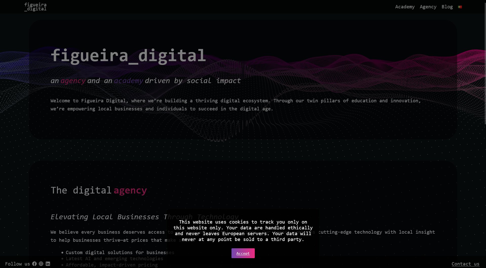

# Figueira Digital WordPress Theme

A modern, responsive WordPress theme with a dynamic background effect and clean design.

## Requirements

- WordPress 5.0 or higher
- PHP 7.0 or higher
- Modern web browser with WebGL support

## Installation

1. Download the theme files from this repository.
2. In your WordPress admin panel, go to Appearance > Themes and click the "Add New" button.
3. Click "Upload Theme" and choose the downloaded zip file of this theme.
4. Click "Install Now" and then "Activate" to start using the theme.

## Usage

### Customizing the Header

- The site title and tagline can be changed in the WordPress Customizer under "Site Identity".
- To edit the navigation menu, go to Appearance > Menus in the WordPress admin panel.

### Footer Content

- Create a new page with the slug "footer-content".
- Add your desired footer content to this page.
- The content of this page will automatically appear in the site footer.

### Background Effect

The dynamic background effect is powered by Three.js. You can customize its appearance by modifying the `background.js` file in the `js` folder.

## Customization

To customize the theme further:

1. Edit the `style.css` file to change the theme's appearance.
2. Modify PHP templates in the theme folder to change the structure of different pages.
3. Update JavaScript files in the `js` folder to change interactive behaviors.

## Support

For support, please open an issue in this GitHub repository.

## Contributing

Contributions are welcome! Please fork the repository and create a pull request with your improvements.

## License

This work is licensed under the Creative Commons Attribution-NonCommercial 4.0 International License (CC BY-NC 4.0).

You are free to:
- Share — copy and redistribute the material in any medium or format
- Adapt — remix, transform, and build upon the material

Under the following terms:
- Attribution — You must give appropriate credit, provide a link to the license, and indicate if changes were made.
- NonCommercial — You may not use the material for commercial purposes without explicit permission from the author.

For commercial use, please contact the author for permission.

To view a copy of this license, visit https://creativecommons.org/licenses/by-nc/4.0/